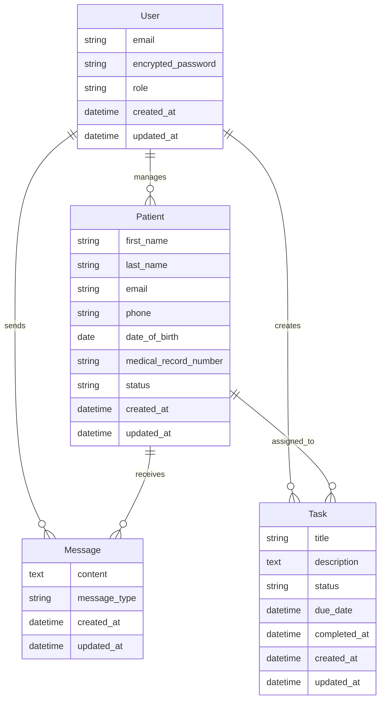

# Telehealth CRM - Architecture Documentation

## Overview

The Telehealth CRM is a modern web application built with Ruby on Rails 7, designed to provide healthcare providers with a comprehensive patient management system. The architecture emphasizes real-time communication, responsive design, and maintainable code through modern Rails patterns and practices.

## System Architecture

### High-Level Architecture

```
┌─────────────────┐    ┌─────────────────┐    ┌─────────────────┐
│   Web Browser   │    │   Mobile App    │    │   Admin Panel   │
│   (Frontend)    │    │   (Future)      │    │   (Future)      │
└─────────┬───────┘    └─────────┬───────┘    └─────────┬───────┘
          │                      │                      │
          └──────────────────────┼──────────────────────┘
                                 │
                    ┌─────────────┴─────────────┐
                    │     Load Balancer         │
                    │     (Nginx/Apache)        │
                    └─────────────┬─────────────┘
                                 │
                    ┌─────────────┴─────────────┐
                    │     Rails Application     │
                    │     (Puma Server)         │
                    └─────────────┬─────────────┘
                                 │
          ┌──────────────────────┼──────────────────────┐
          │                      │                      │
┌─────────┴─────────┐  ┌─────────┴─────────┐  ┌─────────┴─────────┐
│   PostgreSQL      │  │      Redis        │  │   Sidekiq         │
│   (Database)      │  │   (Cache/Queue)   │  │ (Background Jobs) │
└───────────────────┘  └───────────────────┘  └───────────────────┘
```

### Technology Stack

| Layer | Technology | Version | Purpose |
|-------|------------|---------|---------|
| **Frontend** | HTML5, CSS3, JavaScript | - | User interface |
| **Styling** | Tailwind CSS | 2.0 | Utility-first CSS framework |
| **JavaScript** | Stimulus.js | 1.3 | Modest JavaScript framework |
| **Real-time** | Hotwire Turbo | 2.0 | SPA-like functionality |
| **Backend** | Ruby on Rails | 7.2.2.2 | Web application framework |
| **Language** | Ruby | 3.3.0 | Programming language |
| **Database** | PostgreSQL | 15+ | Primary data storage |
| **Cache/Queue** | Redis | 7+ | Caching and job queue |
| **Background Jobs** | Sidekiq | 7.0 | Asynchronous job processing |
| **Web Server** | Puma | 7.0+ | Application server |
| **Testing** | RSpec | 6.0 | Testing framework |
| **Linting** | RuboCop | 1.81 | Code quality |
| **Security** | Brakeman | 6.2 | Security scanning |

## Application Architecture

### MVC Pattern Implementation

```
app/
├── models/           # Data layer (ActiveRecord)
│   ├── user.rb
│   ├── patient.rb
│   ├── message.rb
│   └── task.rb
├── views/            # Presentation layer (ERB + Tailwind)
│   ├── layouts/
│   ├── dashboard/
│   ├── patients/
│   ├── messages/
│   └── tasks/
├── controllers/      # Logic layer (ActionController)
│   ├── application_controller.rb
│   ├── dashboard_controller.rb
│   ├── patients_controller.rb
│   ├── messages_controller.rb
│   └── tasks_controller.rb
└── policies/         # Authorization layer (Pundit)
    ├── application_policy.rb
    ├── patient_policy.rb
    ├── message_policy.rb
    └── task_policy.rb
```

### Domain Model



## Authentication & Authorization

### Authentication (Devise)

- **Strategy**: Email/password authentication
- **User Roles**: Admin and Patient
- **Session Management**: Rails default session store
- **Password Security**: BCrypt hashing with Devise defaults

### Authorization (Pundit)

```ruby
# Policy-based authorization pattern
class PatientPolicy < ApplicationPolicy
  def index?
    user.admin?
  end
  
  def show?
    user.admin? || (user.patient? && record.user == user)
  end
  
  def create?
    user.admin?
  end
end
```

**Authorization Matrix:**

| Action | Admin | Patient | Guest |
|--------|-------|---------|-------|
| View Patients | ✅ All | ❌ | ❌ |
| Create Patient | ✅ | ❌ | ❌ |
| View Own Profile | ✅ | ✅ | ❌ |
| Send Messages | ✅ | ✅ (own thread) | ❌ |
| View Tasks | ✅ All | ✅ Own only | ❌ |
| Create Tasks | ✅ | ❌ | ❌ |

## Data Architecture

### Database Design

**Primary Tables:**
- `users` - Authentication and user management
- `patients` - Patient records and profiles
- `messages` - Communication threads
- `tasks` - Task management and tracking

**Key Relationships:**
- One-to-Many: User → Patients (admin manages multiple patients)
- One-to-Many: Patient → Messages (patient has message thread)
- One-to-Many: Patient → Tasks (patient has assigned tasks)
- Many-to-One: Message → User (message sent by user)

### Data Flow

```
User Action → Controller → Policy Check → Model → Database
     ↓
View Update ← Turbo Stream ← Background Job ← Sidekiq ← Redis
```

## Real-Time Communication

### Hotwire Integration

**Turbo Frames:**
- Patient list with pagination
- Message thread updates
- Task status changes

**Turbo Streams:**
- Real-time message additions
- Task completion updates
- Flash message notifications

**Stimulus Controllers:**
- `patient_search_controller.js` - Search with debounce
- `notification_controller.js` - Flash message handling
- `message_form_controller.js` - Form auto-clear (removed)
- `task_controller.js` - Task interactions (removed)

### Real-Time Flow

```
User Action → Stimulus Controller → Fetch API → Rails Controller
     ↓
Turbo Stream Response → DOM Update → User Sees Change
```

## Background Processing

### Sidekiq Configuration

**Queues:**
- `default` - General background jobs
- `mailers` - Email sending jobs

**Jobs:**
- `WelcomeEmailJob` - Send welcome email to new patients
- `TaskReminderJob` - Daily overdue task notifications

### Job Processing Flow

```
Rails Controller → Job Enqueue → Redis Queue → Sidekiq Worker
     ↓
Email Service ← ActionMailer ← Job Execution ← Background Process
```

## Frontend Architecture

### CSS Architecture (Tailwind)

**Utility-First Approach:**
- Component-based styling
- Responsive design patterns
- Consistent spacing and typography
- Custom component classes

**Key Components:**
```css
.btn-primary { @apply px-4 py-2 font-bold text-white bg-blue-600 rounded hover:bg-blue-700; }
.form-input { @apply block w-full rounded-md border-gray-300 shadow-sm focus:border-blue-500 focus:ring-blue-500 sm:text-sm; }
.status-badge { @apply inline-flex items-center px-2.5 py-0.5 text-xs font-medium rounded-full; }
```

### JavaScript Architecture (Stimulus)

**Controller Pattern:**
```javascript
// patient_search_controller.js
export default class extends Controller {
  static targets = ["input", "results", "loading"]
  static values = { url: String }
  
  search() {
    // Debounced search implementation
  }
}
```

## API Design

### RESTful Routes

```
GET    /patients              # List patients
GET    /patients/:id          # Show patient
POST   /patients              # Create patient
PATCH  /patients/:id          # Update patient
DELETE /patients/:id          # Delete patient

GET    /patients/:id/messages # Patient message thread
POST   /patients/:id/messages # Send message

GET    /tasks                 # Task queue
POST   /tasks                 # Create task
PATCH  /tasks/:id/complete    # Mark complete
```

### Response Formats

**HTML Responses:**
- Standard Rails views
- Turbo Stream updates
- Progressive enhancement

**JSON Responses:**
- Patient search API
- AJAX form submissions
- API endpoints for future mobile app

## Security Architecture

### Security Layers

1. **Authentication** - Devise-based user verification
2. **Authorization** - Pundit policy-based access control
3. **Input Validation** - Strong parameters and model validations
4. **CSRF Protection** - Rails built-in CSRF tokens
5. **SQL Injection Prevention** - ActiveRecord parameterized queries
6. **XSS Protection** - Rails automatic HTML escaping

### Security Scanning

- **Brakeman** - Static analysis security scanner
- **Bundle Audit** - Dependency vulnerability scanning
- **RuboCop** - Code quality and security best practices

## Testing Architecture

### Test Pyramid

```
    ┌─────────────────┐
    │   Feature Tests │  ← Capybara system tests
    │   (8-10 tests)  │
    └─────────────────┘
           │
    ┌─────────────────┐
    │  Controller     │  ← RSpec controller tests
    │  Tests (15+)    │
    └─────────────────┘
           │
    ┌─────────────────┐
    │   Model Tests   │  ← RSpec model tests
    │   (20+ tests)   │
    └─────────────────┘
```

### Testing Strategy

**Model Tests:**
- Validations and associations
- Business logic and scopes
- Policy authorization rules

**Controller Tests:**
- HTTP response codes
- Authorization checks
- Parameter handling

**Feature Tests:**
- End-to-end user workflows
- Cross-browser compatibility
- Real-time functionality

**Test Data:**
- FactoryBot for test data generation
- Faker for realistic test data
- Database cleaner for test isolation

## Deployment Architecture

### Development Environment

```
Developer Machine
├── Ruby 3.3.0 (rbenv/rvm)
├── PostgreSQL 15+ (local)
├── Redis 7+ (local)
├── Rails Server (Puma)
├── Sidekiq Worker
└── Tailwind CSS Watcher
```

### Production Environment

```
Load Balancer (Nginx)
├── Rails App Server 1 (Puma)
├── Rails App Server 2 (Puma)
├── Background Job Server (Sidekiq)
├── Database Server (PostgreSQL)
├── Cache Server (Redis)
└── File Storage (S3/CloudFront)
```

### CI/CD Pipeline

```
GitHub Repository
├── Push/PR Trigger
├── GitHub Actions Runner
├── Test Suite (RSpec)
├── Code Quality (RuboCop)
├── Security Scan (Brakeman)
└── Deploy to Production
```

## Performance Considerations

### Database Optimization

- **Indexes** on frequently queried columns
- **Scopes** for common query patterns
- **Pagination** for large datasets
- **Eager Loading** to prevent N+1 queries

### Caching Strategy

- **Redis** for session storage and job queues
- **Rails.cache** for application-level caching
- **HTTP Caching** for static assets
- **CDN** for production asset delivery

### Background Processing

- **Async Email** sending via Sidekiq
- **Scheduled Jobs** for maintenance tasks
- **Queue Management** for job prioritization

## Scalability Considerations

### Horizontal Scaling

- **Stateless Application** - No server-side sessions
- **Database Connection Pooling** - PgBouncer
- **Load Balancing** - Multiple app servers
- **Background Job Scaling** - Multiple Sidekiq workers

### Vertical Scaling

- **Database Optimization** - Query tuning and indexing
- **Memory Management** - Ruby garbage collection tuning
- **CPU Optimization** - Background job processing

## Monitoring & Observability

### Application Monitoring

- **Rails Logs** - Request/response logging
- **Error Tracking** - Exception monitoring
- **Performance Metrics** - Response time tracking
- **Background Jobs** - Sidekiq monitoring

### Infrastructure Monitoring

- **Database Performance** - Query analysis
- **Redis Monitoring** - Memory and connection tracking
- **Server Metrics** - CPU, memory, disk usage

## Future Architecture Considerations

### Planned Enhancements

1. **Mobile API** - RESTful API for mobile applications
2. **Real-time Notifications** - WebSocket integration
3. **File Uploads** - Active Storage with cloud providers
4. **Advanced Search** - Elasticsearch integration
5. **Multi-tenancy** - Organization-based data isolation

### Technology Evolution

- **Rails 8** - Future framework updates
- **Ruby 3.4+** - Language improvements
- **Hotwire 2.0** - Enhanced real-time features
- **Stimulus 2.0** - Improved JavaScript framework

## Development Guidelines

### Code Organization

- **Single Responsibility** - Each class has one purpose
- **DRY Principle** - Don't repeat yourself
- **YAGNI** - You aren't gonna need it
- **Convention over Configuration** - Follow Rails conventions

### Git Workflow

- **Feature Branches** - One feature per branch
- **Pull Requests** - Code review process
- **CI/CD Integration** - Automated testing
- **Semantic Versioning** - Version management

### Documentation Standards

- **README.md** - Setup and usage instructions
- **ARCHITECTURE.md** - Technical architecture (this document)
- **API Documentation** - Endpoint documentation
- **Code Comments** - Complex logic explanation

---

*This architecture document is maintained alongside the codebase and should be updated as the system evolves.*
